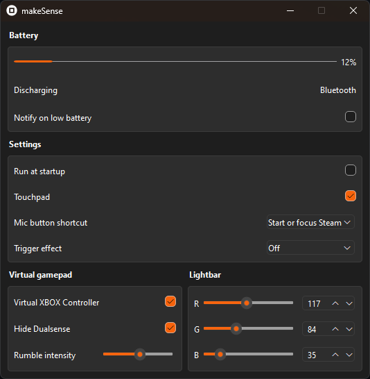

# makeSense

Python Dualsense driver using [dualsense-controller](https://github.com/yesbotics/dualsense-controller-python).

## Features

- Multiple controller support is not implemented. I will probably do it one day.  
- Wireless dongle is not implemented. I will do it if someone request it.

Every setting you change in makeSense will be saved and restored on application restart.

## Download

You need Nefarius [HidHide](https://github.com/nefarius/HidHide/releases/download/v1.5.230.0/HidHide_1.5.230_x64.exe) and [ViGEmBus Driver](https://github.com/nefarius/ViGEmBus/releases/download/v1.22.0/ViGEmBus_1.22.0_x64_x86_arm64.exe) installed in default location.

Restart your computer after installation.

Download [latest build](https://odizinne.net/Odizinne/makeSense/releases/latest) and extract it.

Run `makeSense.exe`.

## Build

If you do not have ViGEmBus driver installer, vgamepad will prompt you to install it.  
You must install HidHide to run makeSense.

To build an executable by yourself, you'll need Python installed.

- Clone this repository:  
`git clone https://github.com/Odizinne/makeSense.git`

- CD inside the cloned folder:  
`cd .\makeSense`

- Install dependencies:
`pip install -r requirements.txt`

- Build with cx_freeze:  
`python .\src\setup.py build`

- Install directory and create startup shortcut:
`python .\src\setup.py install`

## Credits

- [Nefarius](https://github.com/nefarius) (Hidhide, ViGemBus Driver)
- [Yesbotics](https://github.com/yesbotics) (dualsense-controller-python)
- Edited PS logo from [wikimedia](https://commons.wikimedia.org/wiki/File:PlayStation_logo.svg)
- Edited XBOX logo from [wikimedia](https://commons.wikimedia.org/wiki/File:Xbox_Logo.svg)
- Edited dualsense square icon from [Ignire](https://next.nexusmods.com/profile/Ignire/about-me?gameId=1392)
