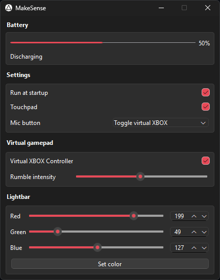

# makeSense

Experimental python Dualsense driver using dualsense-controller 

## Test

What's working:
- LED
- Touchpad
- XBOX controller emulation
- Rumble with emulated XBOX controller should be fixed now, i'll remove rumble checkbox after further testing.

What's partially working:
- Battery percentage

You need Nefarius [HidHide](https://github.com/nefarius/HidHide/releases/download/v1.5.230.0/HidHide_1.5.230_x64.exe) and [ViGEmBus Driver](https://github.com/nefarius/ViGEmBus/releases/download/v1.22.0/ViGEmBus_1.22.0_x64_x86_arm64.exe) installed in default location.

Restart your computer after installation.

Download [latest build](https://github.com/Odizinne/makeSense/releases/download/v0/makeSense.zip) and extract it.

Run `makesense.exe`.

Feel free to open an issue for bug report if you encounter any.

## Build

To build an executable by yourself, you'll need the following dependencies:

- Python
- cx_freeze
- vgamepad
- dualsense-controller
- PyQt6
- winshell
- PyAutoGUI

`pip install cx_freeze PyQt6 winshell PyAutoGUI dualsense-controller vgamepad`

If you do not have ViGEmBus driver installer, vgamepad will prompt you to install it.  
You must install HidHide.

- Clone this repository:  
`git clone https://github.com/Odizinne/makeSense.git`

- Place yourself inside the cloned folder:  
`cd .\makeSense`

- Build with cx_freeze:  
`python .\setup.py build`
